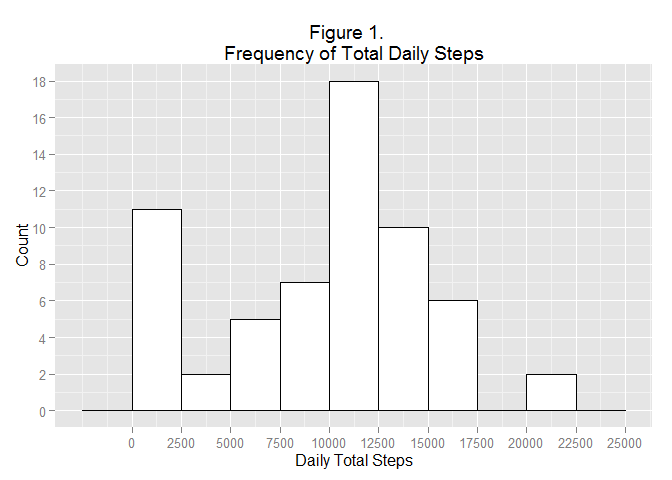
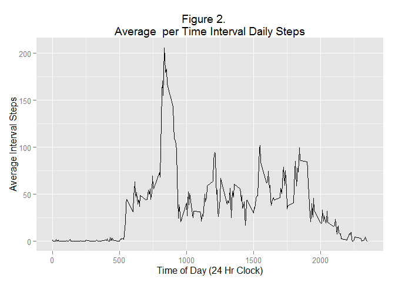
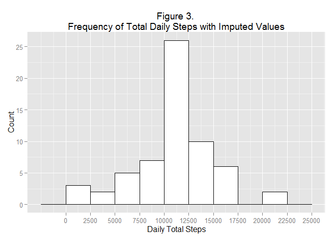
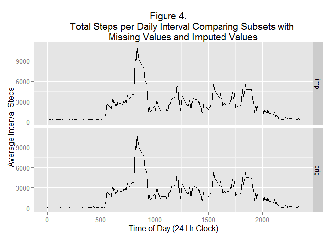
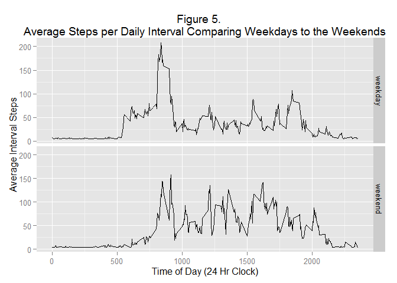

# PA1_template
Austin Overman  
June 24, 2016  

Coursera: Reproducible Research, wk 2 Assignment

##Assignment
This assignment makes use of data from a personal activity monitoring device.
This device collects data at 5 minute intervals throughout the day. The 
data consists of two months of data from an anonymous individual collected 
during the months of October and November, 2012 and include the number of 
steps taken in 5 minute intervals each day.

The data for this assignment can be downloaded from the course web site at the following URL:
https://d396qusza40orc.cloudfront.net/repdata%2Fdata%2Factivity.zip

The variables included in this dataset are:

* __steps__ is the Number of steps taking in a 5-minute interval (missing values are coded as NA)
* __date__ is the date on which the measurement was taken in YYYY-MM-DD format
* __interval__ is the time of the dai in five minute increments

The assignment is to be completed in a single R markdown document that can be processed by knitr and be transformed into an HTML file.

##Solution - Part 1: Loading and preprocessing the data
To start, a working directory is created to store the downloaded data and unzip the archived file as shown in the code below.

```r
## setting an internet file path variable and downloading the NEI data set
## to the new working directory

fileUrl <-
"https://d396qusza40orc.cloudfront.net/repdata%2Fdata%2Factivity.zip"

download.file(fileUrl, destfile = "./activity.zip",
             method = "auto")

list.files()

datedownloaded <- date() 
datedownloaded
## [1] "Sun Jun 12 16:03:44 2016"

## unzipping the entire file
unzip("activity.zip")
```
  

Reading in the data and taking a preliminary look at it.

Below is a sample of the first 6 lines of data. It is observed that there are NAs in the _steps_ variable for some of the time intervals.

```r
library (readr)

steps <- read_csv("activity.csv", 
                  col_names = TRUE, 
                  col_types = "ici",
                  na = "NA")

## converting the date variable
steps$date <- as.Date(steps$date, format = "%Y-%m-%d")

## adding a column to keep this a tidy data set
steps$process <- "orig"
head(steps)
```

```
##   steps       date interval process
## 1    NA 2012-10-01        0    orig
## 2    NA 2012-10-01        5    orig
## 3    NA 2012-10-01       10    orig
## 4    NA 2012-10-01       15    orig
## 5    NA 2012-10-01       20    orig
## 6    NA 2012-10-01       25    orig
```


Reviewing the summary of the data presented below, the mean looks low but it is averaged over all intervals for the day; and there are many zeros (or NAs).

```
##      steps             date               interval        process         
##  Min.   :  0.00   Min.   :2012-10-01   Min.   :   0.0   Length:17568      
##  1st Qu.:  0.00   1st Qu.:2012-10-16   1st Qu.: 588.8   Class :character  
##  Median :  0.00   Median :2012-10-31   Median :1177.5   Mode  :character  
##  Mean   : 37.38   Mean   :2012-10-31   Mean   :1177.5                     
##  3rd Qu.: 12.00   3rd Qu.:2012-11-15   3rd Qu.:1766.2                     
##  Max.   :806.00   Max.   :2012-11-30   Max.   :2355.0                     
##  NA's   :2304
```
  
  


### Question 1): What is mean total number of steps taken per day?
####             (Missing values can be ignored)  
  

####Part A. Calculate the total number of steps taken per day.
Below shows a sample of the aggregated data for the mean, median and total steps taken for all time intervals per day.

```r
## Calculate the mean steps per day, ingnor NAs per 1.A
library(dplyr)

step_stats <- steps %>% 
                group_by(date) %>% 
                        summarise(avg = mean(steps, na.rm = TRUE),
                                  median = median(steps, na.rm = TRUE),
                                  total = sum(steps, na.rm = TRUE))


head(step_stats)
```

```
## Source: local data frame [6 x 4]
## 
##         date      avg median total
## 1 2012-10-01      NaN     NA     0
## 2 2012-10-02  0.43750      0   126
## 3 2012-10-03 39.41667      0 11352
## 4 2012-10-04 42.06944      0 12116
## 5 2012-10-05 46.15972      0 13294
## 6 2012-10-06 53.54167      0 15420
```

```r
mean.ttl.steps <- mean(step_stats$total, na.rm = TRUE)
```
  

Here is a summary of the data. The mean looks low, but it is averaged over all time intervals for the day.

```
##       date                 avg              median      total      
##  Min.   :2012-10-01   Min.   : 0.1424   Min.   :0   Min.   :    0  
##  1st Qu.:2012-10-16   1st Qu.:30.6979   1st Qu.:0   1st Qu.: 6778  
##  Median :2012-10-31   Median :37.3785   Median :0   Median :10395  
##  Mean   :2012-10-31   Mean   :37.3826   Mean   :0   Mean   : 9354  
##  3rd Qu.:2012-11-15   3rd Qu.:46.1597   3rd Qu.:0   3rd Qu.:12811  
##  Max.   :2012-11-30   Max.   :73.5903   Max.   :0   Max.   :21194  
##                       NA's   :8         NA's   :8
```

The mean total dailiy steps is 9354.2295082.
  
####Part B: Make a histogram of the total number of steps taken each day.
The following code generates a histogram of the daily steps, see Figure 1 below. There are a good deal of days that have zero to 2500 steps.

```r
## generate histograms per part 1.B
library(ggplot2)

ggplot(step_stats, 
        aes(x=total)) + 
        geom_histogram(binwidth = 2500, 
                fill = "white",
                color = "black") + 
                xlab("Daily Total Steps") +
                ylab("Count") +
                ggtitle("Figure 1.   
Frequency of Total Daily Steps") +
        scale_x_continuous(breaks = seq(0, 25000, 2500)) +
        scale_y_continuous(breaks = seq(0, 20, 2))
```

 
  

####Part C: Calculate and report the mean and median of the total number of steps taken per day.

```r
step_mean <- as.integer(mean(step_stats$total))
step_med <- as.integer(median(step_stats$total))
```
The mean total steps taken daily is 9354, and the median daily steps is 10395.
  
  

### Question 2): What is the average daily activity pattern?  
  
####Part A: 1.	Make a time series plot of the 5-minute interval and the average number of steps taken, averaged across all days.
The chart below is a time series plot showing the average number of steps taken, averaged across all days for each of the 5-minute intervals through the day. It is observed that there are relatively zero steps taken from late in the day to early morning as previously discussed with spikes and low points through the day indicating on and off activity such as being at work and maybe sitting at a desk for periods of time. The big spike in the early morning could indicate a daily exercise program or maybe this person walks to work. 

```r
## look at the mean steps per interval for all days
step_stats_2 <- steps %>% 
                group_by(interval) %>% 
                        summarise(avg = mean(steps, na.rm = TRUE),
                        total = sum(steps, na.rm = TRUE))

ggplot(step_stats_2, 
        aes(x=interval, 
            y=avg)) + 
        geom_line() +
        xlab("Time of Day (24 Hr Clock)") +
        ylab("Average Interval Steps") +
        ggtitle("Figure 2.    
Average  per Time Interval Daily Steps")
```

 
  

####Part B: Which 5-minute interval, on average across all the days in the dataset, contains the maximum number of steps?

```r
loc <- which.max(step_stats_2$avg)

options(digits=0)

max.step <- step_stats_2[loc, 2]
max.int <- step_stats_2[loc,1]
```
On average, the maximum daily steps occurs for time 835, with an average total of 206 steps.
  
  

##Solution - Part 2: Imputing missing values
  
####Part A. Calaulate and report the total number of missing values in the dataset 

```r
count_na <- sum(as.integer(is.na(steps$steps)))
```
The total number of __NAs__ for the original *step* variable 
is 2304.
  
####Part B. Create a new dataset that is equal to the original dataset but with the missing data filled in.
Imputing to replace the NAs will be done with the __Hmisc__ package and the method option set to _mean_. Note in the following summary that there are no longer any NAs in the _steps_ variable.

```r
## imputing the missing values 
library(Hmisc)

## creating a second data set to include imputed values, and adding the 
## process variable
steps_2 <- select(steps, -process)
steps_2$process <- "imp"

steps_2$steps <- with(steps_2, impute(steps, mean))
```

```
## 
##  2304 values imputed to 37
```

```
##      steps          date               interval      process         
##  Min.   :  0   Min.   :2012-10-01   Min.   :   0   Length:17568      
##  1st Qu.:  0   1st Qu.:2012-10-16   1st Qu.: 589   Class :character  
##  Median :  0   Median :2012-10-31   Median :1178   Mode  :character  
##  Mean   : 37   Mean   :2012-10-31   Mean   :1178                     
##  3rd Qu.: 37   3rd Qu.:2012-11-15   3rd Qu.:1766                     
##  Max.   :806   Max.   :2012-11-30   Max.   :2355
```
  
####Part C.	
####i. Make a histogram of the total number of steps taken each day.
Below is the code to generate the histogram in Figure 3 using the imputed data. It does appear that there are more days with the mean total daily steps, and far fewer with 0 to 2500 daily steps.

```r
## Calculate the mean steps per day

step_stats_3 <- steps_2 %>% 
                group_by(date) %>% 
                        summarise(avg = mean(steps),
                                  median = median(steps),
                                  total = sum(steps))

## generate histogram

ggplot(step_stats_3, 
        aes(x=total)) + 
        geom_histogram(binwidth = 2500, 
                fill = "white",
                color = "black") + 
                xlab("Daily Total Steps") +
                ylab("Count") +
        ggtitle("Figure 3. 
Frequency of Total Daily Steps with Imputed Values") +
        scale_x_continuous(breaks = seq(0, 25000, 2500)) +
        scale_y_continuous(breaks = seq(0, 30, 5))
```

 
  
####ii. Calculate and report the mean and median total number of steps taken per day.

```r
step_mean_2 <- as.integer(mean(step_stats_3$total))
step_med_2 <- as.integer(median(step_stats_3$total))
```
The mean total daily  steps with the imputed values is 10766, and the median daily steps is 10766.
  
####iii. Do these values differ from the estimates from the first part of the assignment?

```r
mean_diff <- step_mean_2 - step_mean
med_diff <- step_med_2 - step_med
```

The difference between the means for the original and imputed data is    1412, and for the median it is 371. Indeed there is a difference between the total with missing values and the total imputed values.
  
####iv. What is the impact of imputing missing data on the estimates of the total daily number of steps?
The following code generates Figure 4 comparing the daily total steps of the original data with missing values and the data with imputed values for the missing _step_ data.

```r
## look at the mean steps per interval for all days

steps_3 <- bind_rows(steps, steps_2)
steps_3$process <- as.factor(steps_3$process)

step_stats_4 <- steps_3 %>% 
                group_by(process, interval) %>% 
                        summarise(avg = mean(steps, na.rm = TRUE),
                        total = sum(steps, na.rm = TRUE))

ggplot(step_stats_4, 
        aes(x=interval, 
            y=total)) + 
        geom_line() +
        xlab("Time of Day (24 Hr Clock)") +
        ylab("Average Interval Steps") +
        ggtitle("Figure 4.    
        Total Steps per Daily Interval Comparing Subsets with 
        Missing Values and Imputed Values") +
        facet_grid(process ~ .)
```

 


```r
step_stats_5 <- steps_2 %>% 
                group_by(interval) %>% 
                        summarise(avg = mean(steps),
                        total = sum(steps))

loc_2 <- which.max(step_stats_5$avg)

options(digits=0)
max.step_2 <- step_stats_5[loc_2, 3]
max.int_2 <- step_stats_5[loc_2,1]
```
The overall daily activity pattern does not seem to have changed. However, there does seem to be a small difference with the total steps with the imputed values as compared to the original data. The imputed maximum total steps per day is 10^{4} at time 835. Which is a difference of 10^{4} steps, but interestingly at the same time of day.

Additional analysis should be conducted to determine if using a different method to impute the missing data would change the results.
  
  
##Solution - Part 3: Are there differences in activity patterns between weekdays and weekends?
  
####Part A. Create a new factor variable in the dataset with two levels - "weekday" and "weekend" indicating whether a given date is a weekday or weekend day.


Below code will create a new variable called _day.type_ to be used in generating a plot of weekday and weekend activity. 

```r
## setting a variable for the type of day in the week: weekend or weekend
weekdays1 <- c('Monday', 'Tuesday', 'Wednesday', 'Thursday', 'Friday')
steps_2$day.type <- c('weekend', 
                       'weekday')[(weekdays(steps_2$date) %in% 
                                           weekdays1)+1L]
## aggregating the daily interval by day type 
step_stats_6 <- steps_2 %>% 
                group_by(day.type, interval) %>% 
                        summarise(avg = mean(steps),
                                  total = sum(steps))
```
  

####Part B. Make a panel plot containing a time series plot of the 5-minute interval and the average number of steps taken, averaged across all weekday days or weekend days. 

The following graph in Figure 5 shows that there is on average different activity levels on the weekdays as compared to the weekends. The weekdays in this graph looks similar to Figure 2, but the weekend graph shows fewer total steps throughout the day, noting that the total steps in the early day are significantly less than the weekdays supporting the hypothesis that the early activity is related to walking to work or exercising in the morning.

```r
ggplot(step_stats_6, 
        aes(x=interval, 
            y=avg)) + 
        geom_line() +
        xlab("Time of Day (24 Hr Clock)") +
        ylab("Average Interval Steps") +
        ggtitle("Figure 5.    
Average Steps per Daily Interval Comparing Weekdays to the Weekends") +
        facet_grid(day.type ~ .)
```

 
